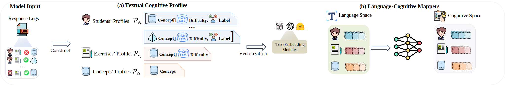

<div align='center'>
<h1>Language Representation Favored Zero-Shot Cross-Domain Cognitive Diagnosis, KDD 2025</h1>

<br/>
<br/>
<a href='https://github.com/ECNU-ILOG/LRCD'></a>
<a href='https://github.com/ECNU-ILOG/LRCD/tree/main/paper/Language Representation Favored Zero-Shot Cross-Domain Cognitive Diagnosis.pdf'></a>

<br/>


</div>

------

# Requirements	

```
joblib==1.3.2
numpy==1.24.3
pandas==2.0.3
scikit-learn==1.3.2
scipy==1.10.1
torch==2.1.1
wandb==0.16.2
```
Please install all the dependencies listed in the `requirements.txt` file by running the following command:

```bash
pip install -r requirements.txt
```

# Data Preprocess

You should process datasets by yourself, you need first 

> cd data


Noting: Due to some embedding text files being too large, we have zipped them. Before starting to run, you need to unzip all files. We upload the zip file on Google Drive. https://drive.google.com/file/d/10A8fdmqLXlMyw824_1zj0btaiRQ07mhf/view?usp=drive_link

# Experiments

Then, you can choose different diagnostic methods based on the provided dataset to run this code. Here is an example:

```shell
python main.py --method=orcdf --train_file=data/SLP-BIO,data/SLP-PHY --test_file=data/SLP-MAT --seed=0 --batch_size=256 --device=cuda:0 --epoch_num=20  --lr=2.5e-4 --latent_dim=64
```


# Reference :thought_balloon:

Shuo Liu, Zihan Zhou, Yuanhao Liu, Jing Zhang, Hong Qian "Language Representation Favored Zero-Shot Cross-Domain Cognitive Diagnosis." In Proceedings of the 31st ACM SIGKDD Conference on Knowledge Discovery and Data Mining, 2025.


## Bibtex

```
@inproceedings{Liu2025LRCD,
author = {Shuo Liu and Zihan Zhou and Yuanhao Liu and Jing Zhang and Hong Qian},
booktitle = {Proceedings of the 31st ACM SIGKDD Conference on Knowledge Discovery and Data Mining},
title = {Language Representation Favored Zero-Shot Cross-Domain Cognitive Diagnosis},
year = {2025},
address={Toronto, Canada}
}
```
 
